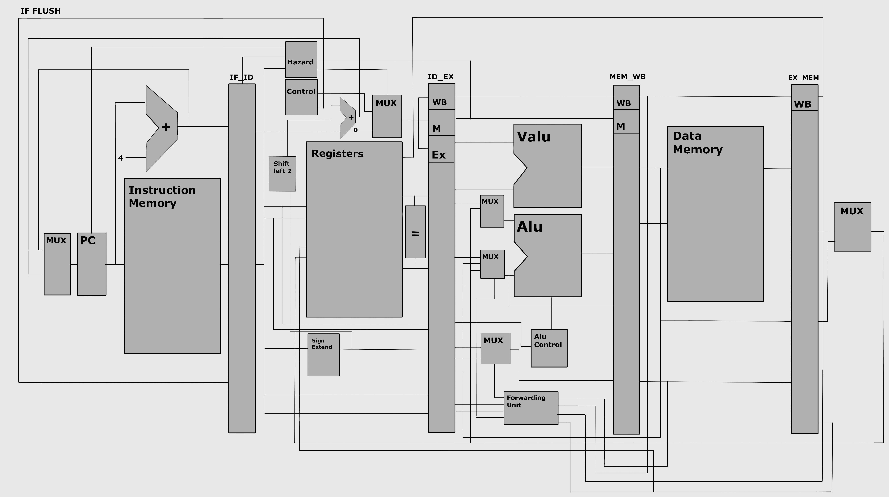

# RV32IV RISC-V CPU (Vector Extension, FPGA/Simulation)

## 📌 Overview
This is a **32-bit 5-stage pipelined RISC-V CPU** supporting the **RV32I base ISA** and **Vector Extension (RVV)** instructions for basic SIMD-style arithmetic.  
The design includes scalar and vector functional units, hazard detection, and forwarding logic for improved performance.

The project supports **RTL simulation**, **gate-level simulation** (functional), and **FPGA synthesis**.  
Simulation is verified with **Icarus Verilog (iverilog)**, and synthesis can be done with **Design Compiler**.

---
## Architecture planning

---
## 🛠️ Usage

### Prerequisites
- **Icarus Verilog** (`iverilog` & `vvp`) – [Installation Guide](https://iverilog.fandom.com/wiki/Installation)
- (Optional) **Design Compiler** for synthesis
- (Optional) **APR flow** (Innovus/OpenROAD) for layout

### Running RTL Simulation
```bash
iverilog -o cpu_sim testbench.v CPU.v
vvp cpu_sim
